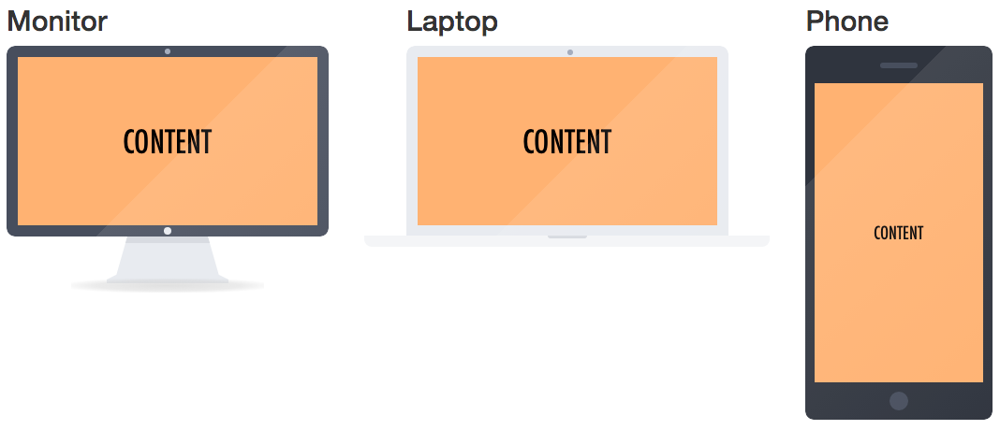

Monitorize.js
-------------
A very small jQuery plugin that allows you to present content within a CSS-based monitor/laptop/smartphone design.

Plugin based on the [design from Will Paige](http://codepen.io/willpaige/pen/rFElD) which in turn is based on [Pierre Borodin's design](https://dribbble.com/shots/997747-Apple-flat-devices-Episode-2-PSD?list=searches&tag=flat_icon)

The result looks like the examples below:

Usage
=====
Include the .js and .css file in your page. Then simply choose your content with jQuery and call the monitorize function. 

    $("items").monitorize({
        type: "monitor",    // TYPE OF SCREEN: "monitor", "laptop", or "phone"
        base: true,         // DOES MONITOR HAVE A BASE? (Only for "monitor" type)
        shadow: true,       // DOES THE SCREEN HAVE A SHADOW?
        reflection: true,   // DOES THE SCREEN HAVE A SHINY REFLECTION?
        size: "small"       // SIZE OF DESIGN large-small (By default medium size)
     })
     
All parameters are optional, in the default case you will get the medium sized monitor. For more examples, check the project's [GitHub page](http://onurferhat.com/monitorize.js/).